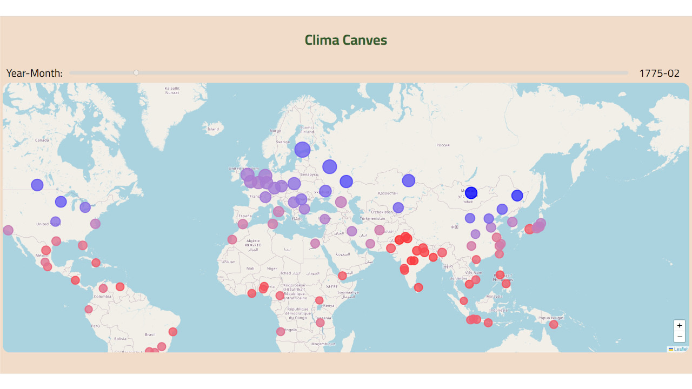

# Climate Canvas

The climate canvas application is a realtime visualization of the Earth Surface Temperature dataset which covers over 3000 cities worldwide from 1943 to 2013. The data is organized in a quadtree to enable efficient rendering. 

#### The application:



## Running the climate canvas

1. **Create conda environment and install required packages:**

    ```
    conda create --name WebGL
    conda activate WebGL
    conda install -c conda-forge nodejs
    npm install -g npm@10.2.3
    npm install -g http-server
    ```

2. **Project-Setup:**

    ```
    cd <Projektordner>
    cd public
    http-server
    ```
## User Guide

### Map Navigation
Upon launching Clima Canvas, a map is displayed with a slider above it. The map operates like any standard mapping application. You can drag the map to explore different regions and use the zoom functionality to get a closer or broader view.

### Data Visualization
Points are plotted on the map to represent various cities, each carrying temperature information. The color of these points corresponds to the temperature of the selected year and month, indicated by a slider above the map. This dynamic visualization allows you to observe temperature variations across different geographical locations. Hovering over a plotted point shows a pop-up with information on the city and the temprerature.

## Code documentation

### Web Application

Our web application is developed using Node.js, with HTML for information display and JavaScript for data manipulation. Upon launching the app, our preprocessed dataset is loaded, populating the Quadtree and displaying initial information. The application features points on the map, where the color reflects the temperature, also displayed in the popup on hover, for the selected year/month using an adjustable slider, the slider can also be controlled by the arrow keys for finer adjustment. As the map is moved or zoomed, new data is efficiently loaded thanks to the Quadtree, ensuring a seamless experience without user wait times. The Quadtree utilizes latitude and longitude for spatial indexing, and the Leaflet library aids in determining the displayed viewport from the upper-left to the lower-right corners.

#### Quadtree

The Quadtree employed in our application is encapsulated within the QuadtreeNode class, serving as an efficient spatial data structure for organizing and querying geographical points. This implementation follows a recursive subdivision approach, dynamically dividing the geographical space into quadrants as necessary.

#### Insertion of Points
The insert method handles the addition of points to the Quadtree. If a node has not reached its maximum capacity (maxPoints), the point is simply added. However, upon exceeding this capacity and having no subnodes, the node undergoes subdivision (subdivide method), redistributing existing points into the newly created quadrants.

#### Subdivision
The subdivide method partitions the node into four quadrants, each represented by a child node. This recursive division process continues as the Quadtree grows, maintaining an organized hierarchy of spatially related data.

#### Index Calculation
The getIndex method determines the quadrant index for a given point based on its latitude and longitude. This index is crucial for correctly placing the point within the appropriate quadrant during insertion and querying operations.

#### Querying Range
The queryRange method retrieves points within a specified geographical range. It efficiently traverses the Quadtree, checking for overlaps between the query range and each node's bounds, thus optimizing the search for relevant data points.

#### Bounds Overlap and Point Inside Range
The boundsOverlap method checks if the bounds of a node overlap with a specified range, ensuring that only relevant nodes are considered during querying. Additionally, the pointInsideRange method determines whether a point lies within a given range, aiding in the accurate identification of points to include in the query results.

This Quadtree implementation enhances the speed and efficiency of our Clima Canvas application by providing a scalable and organized structure for handling the extensive Climate Change dataset.

### Pre-processing

For preprocessing, we performed data aggregation steps to reduce the data size, and seasonal data imputation to fill missing values. The preprocessing was done in the notebook data preprocessing.ipynb.

#### Data imputation example of the city Arhus:


